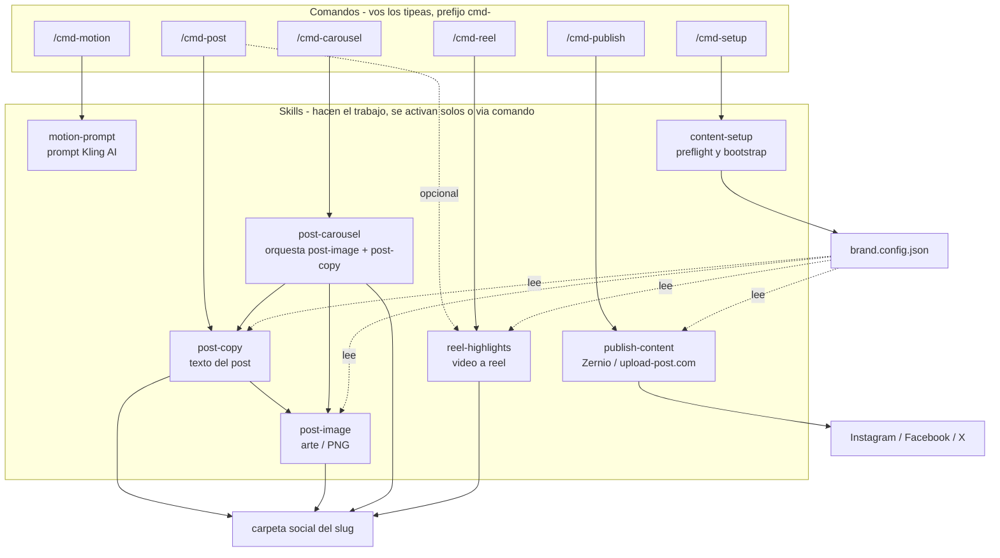

<div align="center">

# 🎬 post-studio

**Creación y publicación de contenido para redes sociales, para cualquier marca — como plugin de Claude Code.**

Texto, imágenes, carruseles, reels y prompts de animación — generados con tu marca (logo, colores, tono) y publicados directo en Instagram, Facebook, TikTok y X.


</div>

---

## Índice

- [¿Qué es post-studio?](#qué-es-post-studio)
- [Características](#características)
- [Arquitectura](#arquitectura)
- [Instalación](#instalación)
- [Inicio rápido](#inicio-rápido)
- [Comandos](#comandos)
- [Skills](#skills)
- [Comandos vs. skills — cómo se activa cada cosa](#comandos-vs-skills--cómo-se-activa-cada-cosa)
- [Configuración de marca](#configuración-de-marca)
- [Estructura de carpetas](#estructura-de-carpetas)
- [Portabilidad multiplataforma](#portabilidad-multiplataforma)
- [Requisitos](#requisitos)
- [Extender el plugin](#extender-el-plugin)
- [Limitaciones conocidas y roadmap](#limitaciones-conocidas-y-roadmap)
- [Licencia](#licencia)

---

## ¿Qué es post-studio?

**post-studio** es un plugin de [Claude Code](https://claude.com/claude-code) que cubre el ciclo completo de contenido de redes sociales: **escribir → diseñar → publicar**.

No está pensado para una marca en particular. El plugin no tiene ningún nombre de marca, logo, color ni URL escrito adentro — todo eso vive en el proyecto donde se instala, en dos archivos: `CLAUDE.md` (reglas de marca en prosa) y `brand.config.json` (la misma información, en formato que los skills pueden leer mecánicamente). Instalás el plugin una vez y lo reusás en tantas marcas/proyectos como quieras, cada uno con su propia configuración.

La otra idea central es que **nada falla en silencio**. Antes de crear o publicar algo, el plugin verifica que exista lo que hace falta (carpetas, logo, software, conexión al navegador) y, si falta algo, te dice exactamente qué hacer — nunca asume, nunca improvisa un resultado a medias.

## Características

- 📝 **Copy multiplataforma** — caption + hashtags para Instagram, Facebook, TikTok, X y YouTube Shorts, siguiendo el tono y las reglas de tu marca.
- 🖼️ **Arte de imagen automático** — genera el PNG final (layout con panel lateral o imagen completa) a partir de tu logo y un póster/foto/arte fuente, con el color del panel calculado del color dominante de la imagen.
- 🎠 **Carruseles** — un solo post con N imágenes, texto unificado.
- 🎞️ **Reels** — tres modos: recorte automático de highlights (15-30s con arco emocional), conversión de un video completo a formato vertical, o fusión de varios videos en un único reel.
- 🎨 **Prompts de animación para Kling AI** — a partir de una imagen real, listo para pegar.
- 📤 **Publicación real** — Zernio como herramienta principal, upload-post.com como respaldo automático cuando se acaba el cupo, con una verificación de reglas de marca obligatoria antes de publicar.
- 🧩 **Agnóstico de marca** — el logo puede ser PNG, JPG o SVG de cualquier proporción; los colores se adaptan solos; nada asume un nombre de marca fijo.
- 🛡️ **Preflight con red de seguridad** — un skill dedicado (`content-setup`) valida carpetas, software, logo y conectores antes de que el resto falle a mitad de camino.
- 🌐 **Portable entre sistemas operativos** — sin rutas de Windows hardcodeadas; detecta fuentes, navegador y comandos de instalación según el SO real.
- 🧱 **Extensible** — agregar un skill nuevo sigue un contrato simple y no rompe lo que ya existe (ver [Extender el plugin](#extender-el-plugin)).

## Arquitectura



Todos los skills leen `CLAUDE.md`/`brand.config.json` del proyecto en el que corren — el diagrama es siempre el mismo, cambia únicamente qué marca hay configurada.

## Instalación

Una sola vez por máquina/proyecto:

```
/plugin marketplace add <ruta-o-repo-que-contiene-plugin/>
/plugin install post-studio@<nombre-del-marketplace>
```

Después, corré el chequeo de entorno:

```
/cmd-setup
```

`content-setup` valida (y crea si falta) las carpetas de contenido, confirma tu logo, arma `brand.config.json` a partir de `CLAUDE.md` si ya existe, revisa que tengas `ffmpeg`/Python/Chrome instalados, y confirma que el conector de Chrome real esté conectado en Claude. Si algo falta, te da el paso exacto para resolverlo.

## Inicio rápido

```
/cmd-post Nombre de tu producto o show, categoría X
```

Claude pregunta lo que le falte (audios/subtítulos si aplica, tipo de post, layout de imagen) y entrega:

```
<contentRoot>/social/nombre-de-tu-producto/
├── post.txt              # caption + hashtags, listo para pegar
└── images/
    └── 01-nombre-de-tu-producto.png
```

Para publicarlo: `/cmd-publish nombre-de-tu-producto`.

## Comandos

Todos empiezan con `cmd-` a propósito: así se distinguen a simple vista de los skills (que se activan solos, sin que los tipees) — cero ambigüedad sobre qué se está invocando.

| Comando | Argumento | Qué hace | Dispara |
|---|---|---|---|
| `/cmd-post` | tema / nombre | Post de una sola imagen: texto + arte, con reel opcional | `post-copy`, `post-image`, `reel-highlights` (opcional) |
| `/cmd-carousel` | nombre de colección | Post de carrusel (N imágenes, un solo texto) | `post-carousel` |
| `/cmd-reel` | video(s) | Reel vertical con marca de agua — highlights, video completo, o fusión | `reel-highlights` |
| `/cmd-motion` | imagen | Prompt de movimiento (image-to-video) para Kling AI | `motion-prompt` |
| `/cmd-publish` | contenido a publicar | Publica o programa en redes sociales | `publish-content` |
| `/cmd-setup` | — | Verifica y prepara el entorno completo | `content-setup` |

## Skills

<details>
<summary><strong>📝 post-copy</strong> — texto del post</summary>

Escribe caption + hashtags (juntos, en un solo bloque) para Instagram/Facebook/TikTok/X/YouTube Shorts, siguiendo el tono y las reglas de marca del proyecto. Para TikTok/Shorts genera además un guion corto con marcas de tiempo; para X, una versión recortada del caption.

**Se activa cuando** pedís crear, redactar o armar el texto de un post.
**Verificaciones obligatorias**: hook único, sin menciones prohibidas, CTA de marca incluido tal cual, sin promesas fuera de lo soportado.
</details>

<details>
<summary><strong>🖼️ post-image</strong> — arte de imagen</summary>

Renderiza el PNG final a partir de un template HTML reutilizable (motor propio del plugin, sin dependencias externas de diseño): layout `panel_lateral` (con filas de info tipo audio/subtítulo) o `full_bleed` (imagen completa + franja inferior). El color del panel sale del color dominante de la imagen fuente por default; el logo y su proporción se resuelven dinámicamente, cualquiera sea la marca.

**Se activa cuando** hay que generar la pieza visual de un post.
**Detalle técnico**: renderiza en una carpeta de trabajo temporal (fuera del proyecto) vía Chrome headless, y solo copia el PNG final al proyecto — no deja archivos intermedios.
</details>

<details>
<summary><strong>🎠 post-carousel</strong> — post de varias imágenes</summary>

Orquesta `post-image` (una vez por imagen) y `post-copy` (una vez, en modo carrusel) para producir un solo post con N imágenes y un texto unificado que invita a deslizar.

**Se activa cuando** pedís un post con varias imágenes/productos en un carrusel, o mencionás una carpeta de colección.
</details>

<details>
<summary><strong>🎨 motion-prompt</strong> — prompt de animación para Kling AI</summary>

Analiza una imagen real (composición, capas, sujetos, mood) y escribe un prompt de movimiento imagen-a-video: solo describe qué se mueve y cómo, nunca la apariencia (evita redundancia y reproducir descripciones con derechos de autor). Incluye siempre un negative prompt para evitar logos/caras distorsionadas.

**Se activa cuando** pedís animar una imagen puntual en Kling AI.
**No genera archivos** — el prompt se muestra en el chat, listo para copiar.
</details>

<details>
<summary><strong>🎞️ reel-highlights</strong> — video a reel</summary>

Tres modos:
- **Highlights**: analiza un video, arma un arco (gancho → desarrollo → cierre) de 15-30s con transiciones.
- **Video completo**: mantiene el video entero sin cortar, solo aplica formato vertical + marca de agua.
- **Fusión**: combina los mejores momentos de 2+ videos en un único reel.

Usa `ffmpeg`. Incluye scripts propios para formato vertical, unión con transición (`xfade`), marca de agua (logo + texto de marca, con medición automática del ancho del texto), y verificación de que el audio final no haya quedado en silencio.

**Se activa cuando** pedís un reel/clip/highlight a partir de video(s) existentes.
</details>

<details>
<summary><strong>📤 publish-content</strong> — publicar en redes</summary>

Publica o programa contenido ya generado, vía navegador Chrome real (nunca el sandbox). Zernio primero, upload-post.com como respaldo automático según una tabla de cupo. Antes de publicar, corre una verificación de marca obligatoria (menciones prohibidas, CTA, tono, coherencia) contra `brand.config.json`/`CLAUDE.md` — si algo no pasa, se detiene y explica por qué, nunca publica a medias.

**Se activa cuando** pedís publicar, subir, postear o programar algo a redes.
</details>

<details>
<summary><strong>🛡️ content-setup</strong> — preflight y bootstrap</summary>

La red de seguridad del plugin. Verifica, en orden: carpetas del proyecto (ofrece crearlas), `brand.config.json` (lo arma con una entrevista corta, proponiendo valores de `CLAUDE.md` si existe), logo (detecta PNG/JPG/SVG, ofrece recortar si tiene margen), software necesario según lo que se vaya a usar (`ffmpeg`/`ffprobe`/Python/Chrome, con el comando de instalación correcto para el SO detectado), y el conector de Chrome real en Claude.

**Se activa** al correr `/cmd-setup`, o cuando otro skill detecta que falta algo y no puede seguir sin resolverlo primero.
</details>

## Comandos vs. skills — cómo se activa cada cosa

| | Comandos (`/cmd-*`) | Skills |
|---|---|---|
| Se invocan | Escribiéndolos vos, a propósito | Solos, cuando tu pedido en lenguaje natural calza con la descripción del skill |
| Ejemplo | `/cmd-post Frieren` | "Hacéme un post de Frieren" (sin tipear nada especial) |
| Por qué el prefijo `cmd-` | Para que se note a simple vista, al leerlo o escribirlo, que es un atajo explícito — nunca se confunde con el nombre de un skill |
| Relación | Cada comando invoca uno o más skills | Los skills son los que realmente hacen el trabajo |

## Configuración de marca

`brand.config.json` vive en la raíz del proyecto que instala el plugin (no dentro del plugin). Es una cache mecánica derivada de `CLAUDE.md` — `content-setup` la arma/actualiza, los demás skills la leen.

| Campo | Tipo | Para qué se usa |
|---|---|---|
| `brandName` | string | Nombre de la marca |
| `website` | string | Texto de marca de agua en reels, referencia general |
| `whatsapp` | string | Contacto mostrado en posts, si aplica |
| `cta` | string | Cierre fijo obligatorio en todo post |
| `tone` | string | Tono de voz esperado del copy |
| `contentRoot` | string | Carpeta raíz de contenido del proyecto (default `POST`) |
| `logoFolder` / `logoFile` | string | Dónde está el logo resuelto |
| `logoAspect` | number | Alto/ancho real del logo (medido, no asumido) |
| `colorMode` | `"auto"` \| `"manual"` | `auto` = color dominante de cada imagen; `manual` = usar los dos siguientes |
| `colorPrimary` / `colorSecondary` | string (hex) | Colores fijos de marca, solo si `colorMode` es `manual` |
| `forbiddenMentions` | string[] | Competidores/menciones que no deben aparecer |
| `unsupportedClaims` | string[] | Cosas que la marca no puede prometer |
| `platforms` | string[] | Plataformas activas, en orden de prioridad |
| `timezone` | string | Zona horaria real para programar publicaciones |

## Estructura de carpetas

**Del plugin** (portable, se instala tal cual en cualquier proyecto):
```
post-studio/
├── .claude-plugin/plugin.json
├── commands/            6 comandos
├── skills/               7 skills
├── templates/            motor HTML del arte de imagen
├── docs/GUIA-DE-USO.md
└── README.md
```

**Del proyecto que lo instala** (esto es lo único que cambia entre marcas):
```
mi-proyecto/
├── CLAUDE.md              reglas de marca, en prosa
├── brand.config.json      la misma info, mecánica
└── <contentRoot>/
    ├── assets/
    │   ├── logo/           PNG, JPG o SVG
    │   ├── posters/         imágenes/fotos fuente
    │   ├── videos/          videos fuente para reels
    │   └── audio/            música opcional para reels
    ├── _template/            copia editable del template (autogenerada)
    └── social/
        └── <slug>/
            ├── post.txt
            ├── images/
            ├── reels/
            ├── tiktok/          (si aplica)
            └── youtube-shorts/    (si aplica)
```

## Portabilidad multiplataforma

Ningún componente del plugin asume Windows, una marca específica, ni una estructura de repo fija:

- **Rutas propias del plugin** vía `${CLAUDE_PLUGIN_ROOT}` — funcionan sin importar dónde se instale.
- **Fuente del watermark de video**: prueba una lista de rutas típicas según el sistema operativo detectado (Windows/macOS/Linux) en vez de una ruta fija; si no encuentra ninguna, avisa en vez de fallar en silencio.
- **Ancho del texto de marca de agua**: se mide renderizándolo una vez y detectando su tamaño real, en vez de un número calibrado a mano que solo serviría para un texto de un largo específico.
- **Proporción del logo**: se mide cargando el archivo real (cualquier PNG/JPG/SVG, cualquier proporción) en vez de un valor fijo.
- **Render de imagen**: ocurre en una carpeta de trabajo plana y temporal, no dentro del proyecto — elimina de raíz los bugs de rutas relativas por profundidad de carpeta.
- **Instalación de software faltante**: `content-setup` da el comando correcto según el SO (`winget`/`choco` en Windows, `brew` en macOS, `apt`/`dnf` en Linux).

## Requisitos

| Herramienta | Para qué skill | Cómo se verifica |
|---|---|---|
| Python 3 | `post-image`, `post-carousel` (preview server) | `content-setup` |
| Chrome/Chromium | `post-image`, `post-carousel` (render headless) | `content-setup` |
| `ffmpeg` + `ffprobe` | `reel-highlights` | `content-setup` |
| Conector de Chrome real (Claude → Settings → Connectors) | `publish-content` | `content-setup`, vía `ToolSearch` |
| Sesión logueada en Zernio y/o upload-post.com | `publish-content` | manual, el skill avisa si detecta que no hay sesión |

## Extender el plugin

1. Usá el skill `skill-creator` (incluido en Claude Code) para armar el `SKILL.md` nuevo con el formato correcto.
2. Seguí el mismo contrato que ya usan los demás: leer `CLAUDE.md`/`brand.config.json` del proyecto (nunca asumir una marca fija), guardar dentro de `<contentRoot>/social/<slug>/...`, y remitir a `content-setup` para cualquier chequeo de entorno en vez de duplicarlo.
3. Colocalo en `skills/<nombre-nuevo>/SKILL.md`. Si querés un atajo de comando, agregá `commands/cmd-<nombre>.md`.
4. No hace falta declarar nada en `plugin.json` — los skills y commands se autodescubren por carpeta.
5. Un skill nuevo puede sumarse a un flujo existente (ej. un formato nuevo dentro de `post-image`) o abrir uno propio (ej. soporte para una red nueva) — las dos formas son válidas.

Guía completa con ejemplos paso a paso: [`docs/GUIA-DE-USO.md`](docs/GUIA-DE-USO.md).

## Limitaciones conocidas y roadmap

| Limitación | Por qué | Cuándo se revisita |
|---|---|---|
| Sin scheduling nativo (cron de Claude) | Publicar todavía necesita que alguien arrastre el archivo al navegador — no se puede automatizar de forma desatendida | Si Zernio/upload-post.com (u otra herramienta) ofrecen publicar por API/curl directo |
| Theming de marca básico (logo + color dominante automático + color manual opcional) | Cubre la mayoría de los casos reales sin configuración extra | Cuando haga falta una paleta de marca más rica (tipografía, múltiples plantillas visuales) |
| Publicación vía automatización de navegador, no API | Es lo que ofrecen hoy Zernio/upload-post.com | Depende de esas herramientas, no del plugin |

## Licencia

Uso privado — sin licencia pública definida todavía (`UNLICENSED` en `plugin.json`).

---

<div align="center">

Construido para funcionar con cualquier marca, no solo la que lo estrenó.

</div>
